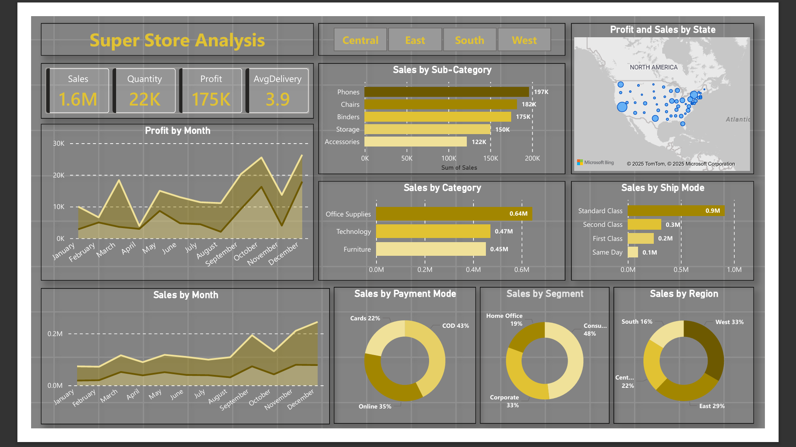
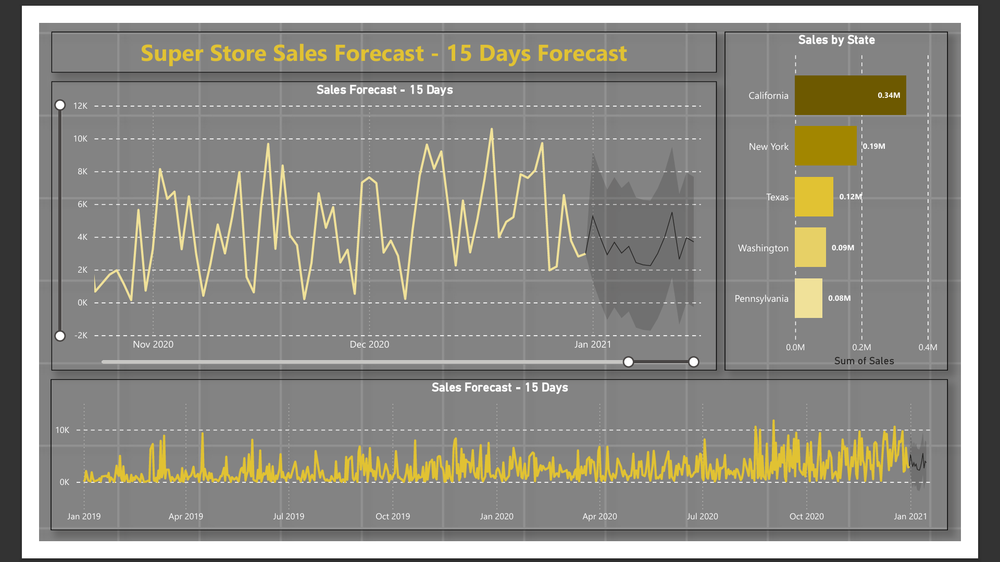

# 🧾  SuperStore Sales Insights Dashboard — Power BI

_A Power BI dashboard that tracks Super Store sales, profit, categories, regions, and provides a 15-day forecast to help understand business performance._

---

## 📌 Table of Contents
- <a href="#overview">Overview</a>
- <a href="#business-problem">Business Problem</a>
- <a href="#dataset">Dataset</a>
- <a href="#tools--technologies">Tools & Technologies</a>
- <a href="#dashboard">Dashboard</a>
- <a href="#final-recommendations">Final Recommendations</a>
- <a href="#author--contact">Author & Contact</a>

---
<h2>Overview</h2>

This project is a Power BI dashboard created to analyze Super Store sales performance.  
It includes sales trends, category-wise insights, state performance, customer segments, and a 15-day sales forecast.  
The main goal of this dashboard is to help understand business performance and identify improvement areas.
---
<h2>Business Problem</h2>

The business needed a clear view of overall sales performance, profit trends, top states,  
and customer behaviour.  
They also wanted a short-term sales forecast to plan inventory and targets.  
This dashboard helps answer key questions like:
- Which categories and states generate the highest sales?
- How do sales change month by month?
- Which shipping modes and payment methods customers prefer?
- What will the sales look like in the next 15 days?

---
<h2>Dataset</h2>

The dataset contains Super Store sales records including:
- Order Date, Ship Date
- Product Category & Sub-Category
- State & Region
- Sales, Profit, Quantity
- Customer Segment
- Payment Mode
The data was cleaned and transformed in Power Query before building visuals.

---

<h2>Tools & Technologies</h2>

- Power BI – Data modelling, visuals, forecasting  
- Power Query – Data cleaning & transformation  
- DAX – Basic measures and calculations  
- Excel – Additional checking and preprocessing  

---
<h2>Dashboard</h2>

### Super Store Sales Dashboard:
- KPIs: Sales, Profit, Quantity, Delivery Time  
- Profit & Sales by Month  
- Sales by Category & Sub-Category  
- Sales by Payment Mode & Ship Mode  
- Sales by Region and State (Map visual)  
- Interactive slicers for region

### 15-Day Forecast Dashboard:
- 15-day sales forecast line chart with confidence interval  
- Trend view of last 2 years  
- Top 5 states by sales  

---

---
<h2>Final Recommendations</h2>

- West and East regions generate the highest sales.  
- California and New York are the top states.  
- Standard Class shipping dominates order volume.  
- Office Supplies and Technology categories perform the best.  
- 15-day forecast shows moderate fluctuations but overall stable trend.

---
<h2>Author & Contact</h2>

**Deepak**  
Data Analyst  
📧 Email: itsdeepak.049@gmail.com  
🔗 [LinkedIn](https://https://www.linkedin.com/in/deepak49//)  
